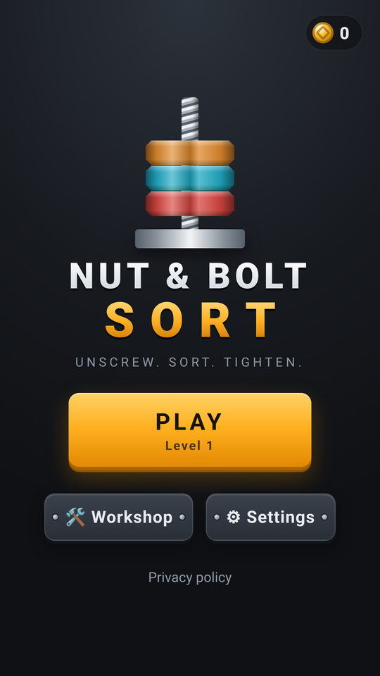
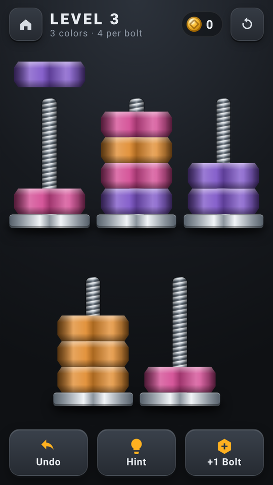
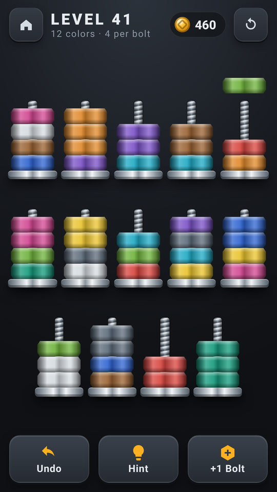
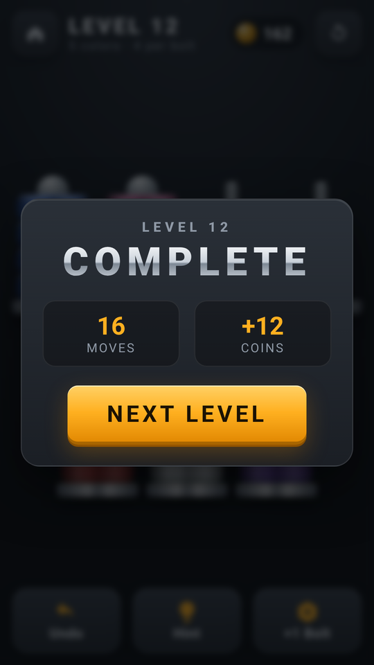

# 🔩 Nut & Bolt Sort

A sleek, **offline nut-and-bolt color-sort puzzle**. Unscrew stacks of anodized nuts, move them between threaded bolts, and tighten every color onto its own bolt. It's written in vanilla HTML/CSS/JavaScript with no framework and ships as an **Android app** (Capacitor 8 + Google AdMob) that **GitHub Actions** builds and signs automatically.

**▶ Play the live demo:** https://offerpk.github.io/nut-bolt-sort/
**Privacy policy:** https://offerpk.github.io/nut-bolt-sort/privacy.html
**Android downloads (signed AAB/APK):** [Releases](https://github.com/OfferPk/nut-bolt-sort/releases)

<p align="center">
  
  
  
  
</p>

## How to play

- Every bolt holds up to **4 nuts** (some later levels use 5).
- **Tap a bolt** to unscrew its top nut, together with every nut of the same color directly under it.
- **Tap another bolt** to screw them on. They can only go onto a nut of the **same color** or onto an **empty bolt**, and only as many as fit.
- A bolt that is full of one color gets capped. You win when every bolt is **full of one color** or **empty**.
- **Undo** (free, unlimited) · **Restart** (free) · **Hint** (▶ rewarded ad, shows the solver's next move) · **+1 Bolt** (▶ rewarded ad, adds a spare bolt once per level).
- Clear levels to earn **coins** and spend them in the **Workshop** on cosmetic finishes: nut finishes, bolt materials and backdrops. Coins can't be bought, cashed out or used for anything else, and there are no loot boxes.

## Features

- **Endless procedural levels.** Level *N* is generated from seed *N*, so it's the same on every device. The difficulty ramps from 3 colors up to 12 (+1 color every 4 levels). From level 25, every 4th level is a "tight" level with only one spare bolt, and from level 60 every 3rd level uses 5-nut bolts. There's a gentler breather level every 10 levels.
- **Every level is verified solvable.** The generator only accepts a board after the built-in solver (weighted A\* with canonical state hashing plus a DFS fallback, in `www/js/logic.js`) has found a solution that replays correctly. `npm test` regenerates **levels 1–1000**, checks their shape, replays every stored solution and re-solves each one from scratch. This runs in CI on every push.
- The same solver powers the **Hint**. It works from any position you reach, including after using +1 Bolt, and tells you when a position is a dead end.
- Screw-twist animations (the nut faces spin as nuts unscrew, fly and tighten), cap-and-spark effects on completed bolts, **WebAudio** metallic sound effects (synthesized, no audio files), and light **haptics** via `@capacitor/haptics`.
- Progress (level, the board you're partway through, undo history, coins and finishes) is saved in `localStorage`.
- Sound, haptics and color-blind marks are saved settings; **Reset Progress** clears game progress, coins and finishes without changing these preferences.
- Industrial, metallic art for a 13+ audience: no mascots, no cartoon style.
- No build step: open `www/index.html` or serve the folder.

## Project layout

```
www/                  ← the whole game (also the Capacitor webDir & the Pages site)
  index.html, css/style.css, privacy.html, icon.png
  js/logic.js         ← pure rules, seeded generator, solver/hint (Node + browser)
  js/game.js          ← UI, animations, persistence, shop, settings
  js/sound.js         ← WebAudio SFX
  js/skins.js         ← cosmetic catalog + nut colors
  js/ads-config.js    ← ★ ALL AdMob IDs + pacing numbers live here
  js/adgate.js        ← interstitial pacing rules (pure, unit-tested)
  js/ads.js           ← UMP consent, banner, interstitial, rewarded
android/              ← Capacitor Android project (committed)
assets/               ← icon/splash generator (make_icon.py) + 512 px store icon
store/                ← Google Play listing kit (graphics, text, answers, checklist)
test/                 ← logic + ad-gate tests (Node) and a headless-Chrome play test
.github/workflows/    ← android.yml (signed AAB/APK + Releases), pages.yml (web demo)
```

## Run locally

```bash
npm install
npm run serve          # http://localhost:8080
npm test               # rules + solver tests, levels 1..1000 solvable, ad-pacing tests
```

Headless phone-size play test (wins levels by tapping, and checks undo, +1 bolt, hint, reload persistence, and console errors):

```bash
npm i --no-save puppeteer-core
node test/browser.test.js http://localhost:8080/ /tmp   # Chrome at /usr/bin/google-chrome (or CHROME=...)
```

`?level=N` in the URL jumps straight to level N, which is handy for testing.

## Ads (AdMob) and the ad rules

| Hook | When | In a browser |
|---|---|---|
| `Ads.init()` | on launch: **UMP consent** + SDK init only, **no ad is shown** | no-op |
| `Ads.showBanner()` | only while the **gameplay screen** is open (adaptive banner in its own strip under the board) | no-op |
| `Ads.maybeInterstitial(gate)` | only on **Level complete → Next**, when `AdGate` allows it | never |
| `Ads.showRewarded(cb)` | only when the player taps **Hint** or **+1 Bolt**. The reward is granted only on the SDK's *earned reward* event | grants the reward immediately |

Interstitial pacing, enforced in `www/js/adgate.js` and tested in `test/adgate.test.js`:

- **None** until the player has completed **level 5** *and* played for **3 minutes** in total.
- After that, at most **one every 3 completed levels** and at most **one per 90 s**, only between levels. Preloading never blocks the player: if an ad isn't ready, the game simply continues.
- **Never** on launch, exit or back press. There are no app-open ads, and the pacing state is saved so restarting the app doesn't reset it.

### Swapping in your real AdMob IDs

The repo uses **Google's official test IDs**. Change them in exactly **two** places:

1. **`www/js/ads-config.js`**: set `APP_ID`, `BANNER_ID`, `INTERSTITIAL_ID` and `REWARDED_ID`, then set `IS_TESTING: false`.
2. **`android/app/src/main/AndroidManifest.xml`**: set the `com.google.android.gms.ads.APPLICATION_ID` meta-data value to your real **App ID** (`ca-app-pub-XXXX~YYYY`).

Then bump the version, commit and tag. CI builds a new signed AAB. In AdMob, also publish a **Privacy & messaging → GDPR message** so the consent form appears, and add an `app-ads.txt` to your developer website.

## Android build

- Capacitor 8, appId **`com.offerpk.nutboltsort`**, name **Nut & Bolt Sort**, plugins `@capacitor-community/admob` 8.1.0 and `@capacitor/haptics` 8.
- `compileSdk`/`targetSdk` **36**, `minSdk` **24**, versionCode **1**, versionName **1.0.0** (in `android/app/build.gradle` / `android/variables.gradle`).
- Permissions: `INTERNET`, `ACCESS_NETWORK_STATE`, `AD_ID` (AdMob) and `VIBRATE` (haptics). No billing: the game has no purchases.

### CI (GitHub Actions)

`.github/workflows/android.yml` runs on every push to `main`, on `v*` tags, and on manual dispatch: Node 22 + JDK 21 → `npm ci` → `npm test` → `npx cap sync android` → `./gradlew bundleRelease assembleRelease` → it prints the APK's `targetSdkVersion` with `aapt2` and verifies the signatures. The signed **`.aab`** and **`.apk`** are uploaded as artifacts, and a `v*` tag also creates a **GitHub Release** with both files attached. `pages.yml` deploys `www/` to GitHub Pages.

Signing uses these repository secrets (the keystore and passwords are **never** committed):

| Secret | Contents |
|---|---|
| `KEYSTORE_BASE64` | `base64 -w0 upload.jks` |
| `KEYSTORE_PASSWORD` | keystore password |
| `KEY_ALIAS` | key alias (`upload`) |
| `KEY_PASSWORD` | key password |

### Build locally

```bash
npm ci
npx cap sync android
cd android
ANDROID_KEYSTORE_FILE=/path/upload.jks KEYSTORE_PASSWORD=... KEY_ALIAS=upload KEY_PASSWORD=... \
  ./gradlew bundleRelease assembleRelease
```

### Icons and splash

`python3 assets/make_icon.py` regenerates the original launcher icons (legacy, round and adaptive foreground), the splash screens, `www/icon.png` and the 512 px store icon.

## Releasing to Google Play

See **[`store/LAUNCH-CHECKLIST.md`](store/LAUNCH-CHECKLIST.md)** (it opens with a Roman Urdu summary), [`store/listing-en.md`](store/listing-en.md) and [`store/play-console-answers.md`](store/play-console-answers.md).

1. Bump `versionCode` (+1 every upload) and `versionName`, and switch to your real AdMob IDs.
2. `git tag v1.0.1 && git push origin v1.0.1`. CI attaches `nut-bolt-sort-v1.0.1.aab` and `.apk` to a Release.
3. Upload the `.aab` in Play Console with **Play App Signing** turned on. The CI keystore is your **upload key**.

## License

[MIT](LICENSE) © 2026 OfferPk. See also the [Privacy Policy](PRIVACY.md).
